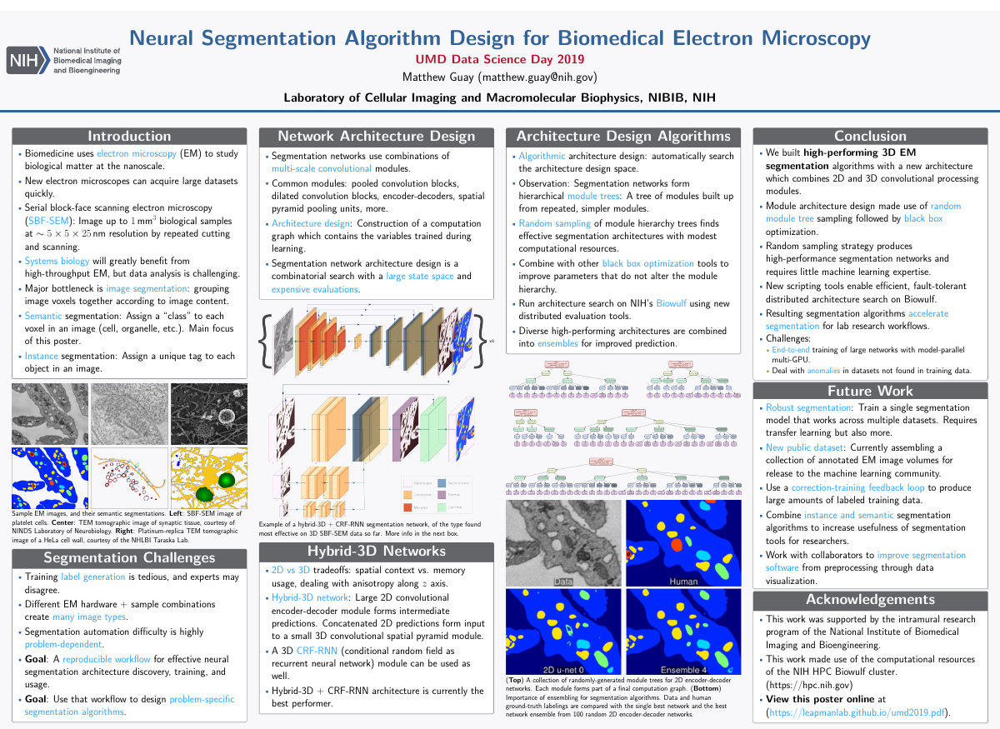
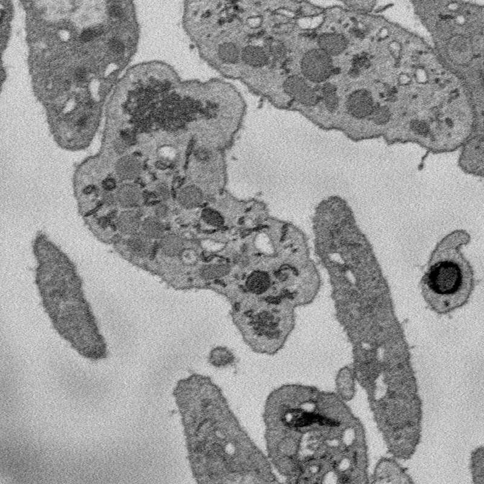
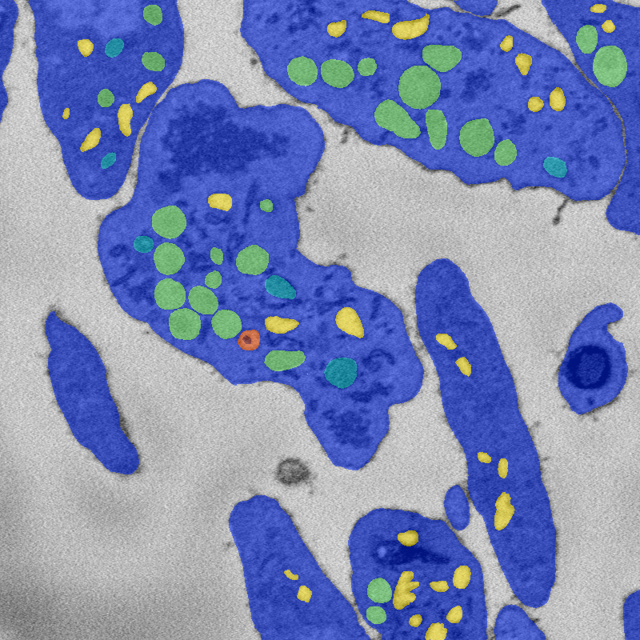
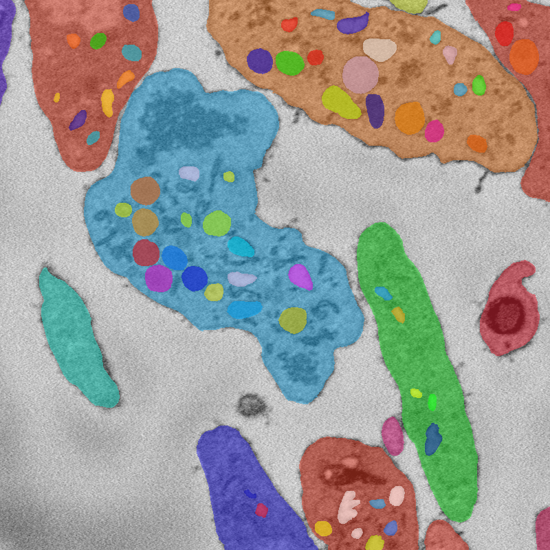
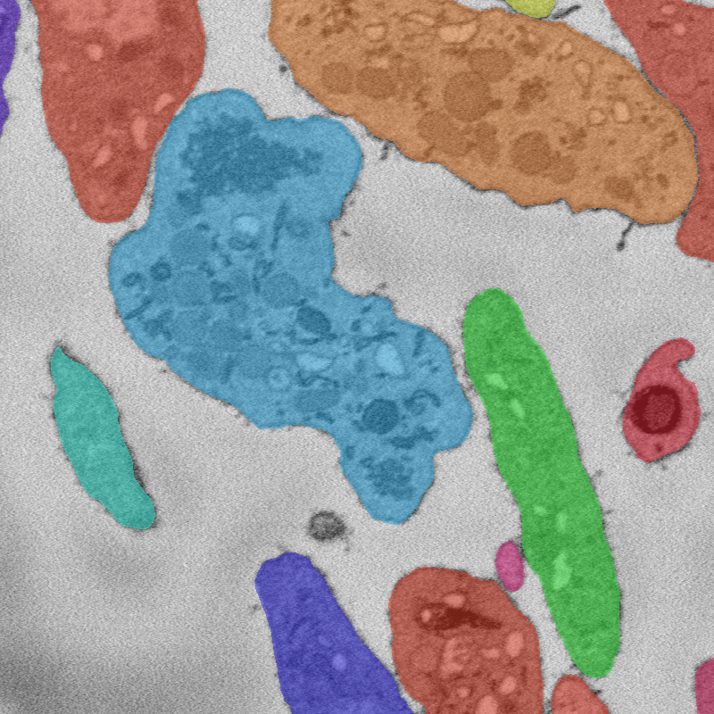
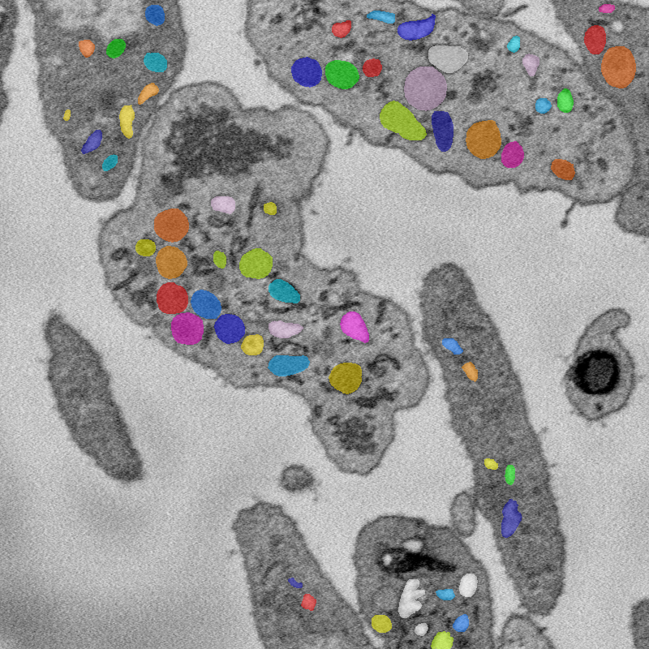

# Image annotation at LCIMB

Our lab [LCIMB](https://www.nibib.nih.gov/labs-at-nibib/laboratory-cellular-imaging-and-macromolecular-biophysics-lcimb), which is a part of the [NIBIB](####NIBIB/NIH), which is an institute of the [NIH](https://www.nih.gov/), is interested in evaluating annotation sourcing companies for labeling biomedical image data in conjunction with computer vision research projects. 

#### Example of ongoing research

To give you an idea of the work we're interested in doing.

<i>[Click for a higher-resolution image](https://heyitsguay.github.io/aboutus/large.png)</i>

# Who We Are

Right now, there are a few of us at NIBIB who are pursuing this:

#### People

[Dr. Matthew Guay](https://www.nibib.nih.gov/about-nibib/staff/matthew-guay) - Postdoc in LCIMB working on machine learning for image segmentation in biomedical electron microscopy.

[Roberta Albert](https://www.nibib.nih.gov/about-nibib/staff/roberta-albert) - CIO/CTO for NIBIB.

[Dr. Richard Leapman](https://www.nibib.nih.gov/about-nibib/staff/richard-leapman) - Scientific director of NIBIB and LCIMB lab chief.

[Zeyad Emam](https://www.nibib.nih.gov/about-nibib/staff/zeyad-emam) - Graduate student with LCIMB and the University of Maryland, works with Matt on biomedical machine learning and computer vision.

#### Organization

LCIMB: The [Laboratory of Cellular Imaging And Macromolecular Biophysics](https://www.nibib.nih.gov/labs-at-nibib/laboratory-cellular-imaging-and-macromolecular-biophysics-lcimb).

NIBIB: The [National Institute of Biomedical Imaging and Bioengineering](https://www.nibib.nih.gov/).

NIH: The [National Institutes of Health](https://www.nih.gov/).

# Our problem

In LCIMB, we work with electron microscopes (EM) to produce nanoscale images of biological structures. Modern EM hardware such as serial block-face scanning electron microscopes (SBF-SEM) can rapidly produce large 3D images (~1000x4000x4000 voxels). Analysis of these images helps system biologists learn about the structure and function of cells working together in body tissues, but analysis has a severe bottleneck in annotating the images. We would like to automate the process, but producing annotated images for training data is very time-consuming.

## Pilot project

For a pilot project, we will provide one or more 3D EM image datasets, along with a small number of in-lab annotations for each dataset. We are interested in both **instance segmentation** and **semantic segmentation** of cells and subcellular structures. It may be the case that instance segmentation is easier to outsource than semantic segmentation.

Below: An example image, along with semantic and instance segmentation annotations for that image. 

#### Image

An 800x800 window from a 250x2000x2000 SBF-SEM image of human platelet cells.

#### Semantic segmentation

Semantic segmentation of image into seven classes: Background, cytoplasm, and five organelle classes.

#### Instance segmentation

**All**

**Cells**

**Organelles**

Instance segmentation of image. Note that due to the hierarchical organization of cells, some tags are contained inside others.

# Challenges

We have identified the following challenges so far for outsourcing annotations. There may be others.

1. *Interpreting microscopy images*: Unlike natural images, EM images require training to interpret.

2. *3D image structure*: Our images are 3D, and we know from our work in-lab that 3D context is crucial for accurate semantic segmentation by humans. A successful annotation workflow will likely require workers to look at several consecutive 2D slices at a time.

3. *Accuracy requirements*: In order for annotations to be useful to biomedical research, annotation accuracy needs to be extremely high. We are currently working on developing metrics to quantify that accuracy requirement, based on variance in performance between in-lab experts.
