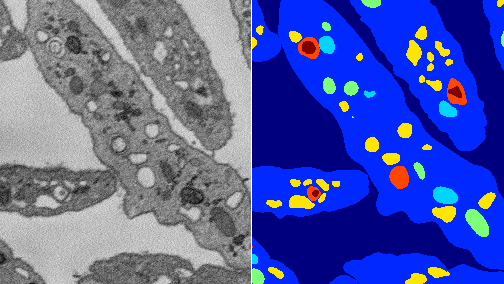
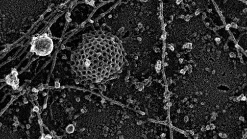
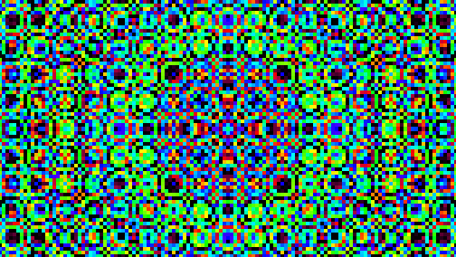
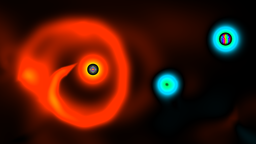

# eyeo 2018

---

## About me

My name is **Matt Guay**! I live in the DC area, and I work at the National Institutes of Health (NIH) on machine learning tools for computer vision problems in microscopy with [these folks](www.nibib.nih.gov/labs-at-nibib/laboratory-cellular-imaging-and-macromolecular-biophysics-lcimb/cellular-and-supramolecular-structure-and-function). I'm interested in **machine learning**, **generative art**, and **VR/AR design**. You can reach me at **matt.d.guay@gmail.com**.

## Show and tell

View show and tell slides [here](showntell.pdf) (PDF)

## Microscopy images

### Platelets

[3D Platelet, SBF-SEM](https://www.dropbox.com/s/b1xthresdccyspr/platelet.zip?dl=1) (ZIP, 60MB)

Courtesy of [LCIMB](https://www.nibib.nih.gov/labs-at-nibib/laboratory-cellular-imaging-and-macromolecular-biophysics-lcimb)

### Cell wall

[2D HeLA cell wall, platinum replica TEM](https://www.dropbox.com/s/k5p82l0k9y0wm24/helawt.zip?dl=1) (ZIP, 250MB)

Courtesy of [Taraska Lab](https://taraskalab.nhlbi.nih.gov)

## Interactive visual sketches

Using JS/WebGL/Three.js. May or may not work on your device. All feedback is appreciated!

### tilewave

### heatsnakes

### apollo

### rules

### gol3d

In boring, web-unfriendly C++!

<iframe width="560" height="315" src="https://www.youtube.com/embed/EW9Q0qMc2Xc" frameborder="0" allow="autoplay; encrypted-media" allowfullscreen></iframe>

<iframe width="560" height="315" src="https://www.youtube.com/embed/d99QK549koI" frameborder="0" allow="autoplay; encrypted-media" allowfullscreen></iframe>

#### Source

<a href="https://github.com/heyitsguay/gol3d">https://github.com/heyitsguay/gol3d</a>

