# FLUX ROUTE — Developer Architecture Guide

*Living reference for the modular ES-module codebase.*
*Cross-references `fluid-puzzle-implementation-plan.md` sections as §N.*

---

## 1. Project overview

A single-page WebGL2 fluid-routing puzzle game. A 2D incompressible fluid
simulation is the entire game world — every game element reads from and writes
to simulated fields. The player routes colored dye into intake basins by
placing fans, painting walls/lanes, and physically steering a moving boundary
(the player circle).

**Serving:** `python3 -m http.server` from the `agrav/` directory. No bundler,
no build step. ES modules loaded via `<script type="module" src="js/main.js">`.

**Browser caching:** `python -m http.server` sends no cache-busting headers.
During development, use `Ctrl+Shift+R` (hard refresh) after code changes.

---

## 2. File map

```
agrav/
├── index.html              Entry point: canvas, DOM overlays, loads main.js
├── css/style.css            All styling (currently uses px units — mobile issue)
├── docs/
│   └── architecture.md      This file
├── shaders/
│   ├── common.js            Shared GLSL snippets: VS_FULLSCREEN, OBST, ZONES, SPECIES, SPECIES_PHYS
│   ├── sources.js           All fragment/vertex shader source strings (~50KB)
│   └── index.js             Assembles GLSL object consumed by gl-core.js
├── js/
│   ├── state.js             Shared mutable state (S, GW, constants, TOOLS)
│   ├── config.js            Quality presets, simulation constants, params, pulses
│   ├── gl-core.js           WebGL2 context, all GPU resources, programs, JFA, actor helpers
│   ├── simulation.js        Substep loop, splat passes, readback channel, reduction
│   ├── input.js             Keyboard/mouse/touch handlers, placement, painting
│   ├── levels.js            Level definitions (paint functions + dataLevel serialization)
│   ├── main.js              Boot, frame loop, HUD, scoring, events, switches, game logic
│   ├── panel.js             lil-gui tuning panel, config save/load
│   └── editor.js            In-game level editor (polygon/entity/select modes)
├── docs/
│   ├── architecture.md      This file
│   └── mobile-parity.md     Mobile/desktop parity investigation
├── lib/lil-gui.min.js       UMD tuning panel library
├── fluid-puzzle-implementation-plan.md   Design spec (§1–§58)
└── level-design-guide.md    Level design reference
```

---

## 3. Module dependency graph

```mermaid
graph TD
    HTML["index.html"] --> MAIN["main.js"]
    MAIN --> STATE["state.js"]
    MAIN --> CONFIG["config.js"]
    MAIN --> GLCORE["gl-core.js"]
    MAIN --> SIM["simulation.js"]
    MAIN --> INPUT["input.js"]
    MAIN --> LEVELS["levels.js"]
    MAIN --> PANEL["panel.js"]
    MAIN --> EDITOR["editor.js"]

    CONFIG --> STATE
    GLCORE --> CONFIG
    GLCORE --> SHADERS["shaders/index.js"]
    SHADERS --> COMMON["shaders/common.js"]
    SHADERS --> SOURCES["shaders/sources.js"]
    SOURCES --> COMMON
    SIM --> STATE
    SIM --> CONFIG
    SIM --> GLCORE
    INPUT --> STATE
    INPUT --> CONFIG
    INPUT --> GLCORE
    LEVELS --> STATE
    LEVELS --> CONFIG
    LEVELS --> GLCORE
    PANEL --> STATE
    PANEL --> CONFIG
    EDITOR --> STATE
    EDITOR --> CONFIG
    EDITOR --> GLCORE

    style MAIN fill:#1a2a4a
    style STATE fill:#2a1a3a
    style GLCORE fill:#1a3a2a
```



**Key rule:** No circular imports. Cross-module calls that would create cycles
use one of two patterns:

1. **`_cb` callback registry** — Peripheral modules (input, editor, panel)
   import `_cb` and call e.g. `_cb.loadLevel()`. main.js populates `_cb` at
   boot. See §18 of the impl plan.

2. **`inputRef` data bridge** — simulation.js needs player input but can't
   import input.js. Instead, input.js writes to a shared reference object
   that simulation.js reads via `setInputRef()`.

---

## 4. Module responsibilities

### 4.1 `state.js` — Shared mutable state

The single source of truth for all runtime game state. Every module imports
`S` and reads/writes `S.xxx` directly.

| Export | Purpose |
|--------|---------|
| `S` | Mutable state bag: game flow, player/tool state, HUD/scoring, painting, touch, system flags |
| `GW` | Game window rect `{f, u0, v0, u1, v1}` — the playable sub-region |
| `SPIN_TIER_DAMP` | `[8, 4, 2, 1]` — damping multipliers per spin tier |
| `RED, BLUE, GREEN` | Pure species vectors `[1,0,0]`, `[0,0,1]`, `[0,1,0]` |
| `TOOLS` | Tool definitions array (fan, blue, green, wall, steel, lane) |

### 4.2 `config.js` — Constants and configuration

Quality presets, simulation constants, the live `params` object, and the
pulse system. Persists quality choice to localStorage.

| Export | Purpose |
|--------|---------|
| `SIM_W/H, DYE_W/H` | Simulation and dye-field resolution (quality-dependent) |
| `DT, MAX_SUBSTEPS` | Fixed timestep `1/120s`, max 4 substeps/frame |
| `PRESSURE_ITERS, BLUR_PASSES` | Quality-dependent iteration counts |
| `RES_SCALE` | `SIM_H / 270` — normalizes all physics to the reference grid |
| `SIM_TEXEL` | `[1/SIM_W, 1/SIM_H]` — texel-to-UV conversion |
| `TELEM_W` | Telemetry texture width: `2 + N_ACTORS` = 66 |
| `EMIT_K` | Emission constant `6.25` (gaussian integral, §26) |
| `params` | Live-tunable parameter object (copied from `DEFAULT_PARAMS`) |
| `PV(key)` | Pulse-aware param read: returns pulse value if active, else `params[key]` |
| `effScale()` | `entityScale * RES_SCALE` — resolution-independent entity sizing |
| `pulseParam(key, value, dur)` | Event-driven temporary param override |
| `SIZE_F` | Game window size map: `{small: 1/3, medium: 0.5, large: 0.75, full: 1}` |
| `mulberry32(seed)` | Seeded PRNG for deterministic nest spawning |

### 4.3 `gl-core.js` — WebGL2 foundation (§5, §6, §8.2, §9.1)

Creates the GL context, all GPU textures/framebuffers, compiles all shader
programs, and provides the actor table helpers. This is the "hardware layer."

**Context & capabilities (§6):**
- Requires WebGL2 + `EXT_color_buffer_float` (or half-float fallback)
- Canvas sized to `DYE_W × DYE_H`; CSS letterboxes
- `HALF_FALLBACK` flag downgrades RGBA32F → RGBA16F if needed

**Key abstractions:**
- `makeTex(w,h,...)` / `makeRT(...)` / `makePP(...)` — texture, render target, ping-pong pair
- `compile(name, vs, fs)` — shader compilation with error reporting
- `runFS(prog, rt, setup)` — fullscreen pass: bind FBO, use program, call setup, draw triangle
- `drawTo(rt)` / `bindTex(p, name, tex, unit)` — FBO and texture binding with feedback-loop detection
- `runJFA()` — Jump Flood Algorithm for SDF generation at level load (§8.2)

**Texture inventory (§5):**

| Name | Format | Size | Ping-pong | Contents |
|------|--------|------|-----------|----------|
| velocity | RG16F | SIM | yes | Field velocity (texels/sec) |
| pressure | R16F | SIM | yes | Jacobi iterate |
| divergence | R16F | SIM | no | Per-substep scratch |
| curlTex | R16F | SIM | no | Vorticity magnitude |
| dye | RGBA16F | DYE | yes | RGB = 3 species concentrations |
| dynMask | RGBA16F | SIM | no | Actor coverage mask (cleared per substep) |
| obstacle | RGBA16F | SIM | no | Composed obstacle field (§19) |
| gel | R16F | SIM | yes | Reactive gel concentration |
| level | RGBA16F | SIM | no | SDF: R=distance, GB=gradient |
| actors | F32 | 64×4 | yes | Actor table (§9.1) |
| scoreAcc | F32 | SIM | yes | Per-cell delivered dye accumulator |
| regionsTex | RGBA8 | SIM | no | Zone map: R=sink, G=drain, B=trigger, A=sensor |
| walls | RG16F | SIM | yes | R=slate (erodible), G=steel (blast-proof) |
| dyn | RGBA16F | SIM | yes | R=dynamite charge, GB=lane direction |
| wake | R16F | SIM | yes | Predator wake field |
| swState | RGBA16F | 8×1 | yes | Switch state (bank/timer/latched/flux) |
| telemetry | F32 | 66×1 | no | Score + actor positions for CPU readback |

**Actor table (§9.1):** 64 slots × 4 rows of RGBA32F.
- Row 0: pos.xy (UV), vel.zw (UV/s)
- Row 1: type, radius, strength/param, angle/param
- Row 2: ttl, flags, dye.rg or spin ω/θ
- Row 3: dye.b, spares

Types: 0=empty, 1=player, 2=fan, 3=emitter, 5=piston, 6=predator, 7=nest, 8=pickup

### 4.4 `simulation.js` — Physics substep (§7, §9.2–9.3, §10, §19–§24)

The GPU simulation pipeline. One `substep()` call executes the full pass
sequence from §3 of the impl plan.

**Substep pass order:**
1. `actorUpdate` — physics for all actor types (player thrust/drag/collision, predator AI, piston springs, mass collisions)
2. `splatMask` → `dynMask` — actor boundaries (player, predators)
3. `gelUpdate` (if GEL_ON) — R+B precipitation, dissolve, erosion
4. `obstacleCompose` → `obstacle` — merge level SDF + dynMask + gel + walls into one texture (§19)
5. `splatForce` → velocity — fans, emitters, predator suction (additive blend)
6. `splatDye` → dye — emitter dye injection, predator eating (additive blend)
7. `splatWake` + `wakeUpdate` — predator wake deposit and decay
8. `advect` velocity — semi-Lagrangian backtrace with species-dependent dissipation
9. `curl` + `vorticity` — vorticity confinement with media/wake/species modulation
10. `reactForce` — exothermic R×G force, dynamite detonation, lane/amp forces
11. `divergence` → `jacobi` ×N → `gradientSubtract` — pressure projection (§7.5–7.6)
12. `advect` dye — at DYE resolution
13. `dyePost` — zone absorption (sink/drain/trigger), solid decay, gel/dynamite chemistry
14. `scoreAccum` — ping-pong accumulate delivered dye (pre-absorption dye, §7.8)

**Readback (§10.2):** `ReadbackChannel` — ring of 3 PBOs with fence sync.
- `kick(fbo)` — async readPixels from telemetry + swState + matSum
- `poll()` — check fences, copy completed data into `S.lastTelem`
- **Invariant:** No synchronous GPU→CPU reads. Ever.

**`runReduce(srcTex)`** — generic 2×2 sum-reduction chain to 1×1 pixel.

### 4.5 `input.js` — Player interaction (§18)

Handles all user input: keyboard, mouse, touch. Manages tool placement,
wall/lane painting, item selection/rotation, and the ghost preview.

**Key functions:**
- `readInput()` — called once per frame; reads WASD/arrows into `inputVec`, Q/E into `spinInput`; updates `inputRef` for simulation.js
- `updateGhost()` — positions placement preview at mouse, clamped to arm reach from player (via `S.lastTelem[8..9]`)
- `placeTool(uv)` — validates position, allocates actor slot, writes to GPU
- `paintWall(uv, add, chan)` / `paintLane(uv, add)` — matter painting with well checks
- `updateSelection()` — finds nearest adjustable actor to cursor for rotation/tuning

**Touch support:** Double-tap placement, hold-to-steer, two-finger twist for spin,
toolbar erase toggle. Portrait mode rotates canvas 90° CW via CSS.

**Callback pattern:** Uses `_cb` for functions owned by main.js:
`loadLevel`, `refreshLevelTextures`, `redEmitRate`, `syncBudgetInputs`,
`showToast`, `editorPointerDown`, etc.

### 4.6 `levels.js` — Level content (§8, §53)

Level definitions and the `dataLevel()` serialization wrapper.

**Key exports:**
- `LEVELS` — array of level objects, each with `name`, `paint(gateState)`,
  `winFraction`, `playerStart`, `actors`, `budgets`, `wells`, `switches`,
  `events`, `callouts`, etc.
- `dataLevel(json, extra)` — converts a fluxLevel v1 JSON object into a
  LEVELS-compatible entry. `extra` merges declarative additions (events,
  custom paint). This is the serialize→extend workflow.
- `curLevel()` — returns `LEVELS[S.levelIdx]` (or the attract level for -1)
- Canvas painting helpers: `pxRect()`, `pxPoly()`, `rasterPoly()`, `rasterZones()`

**Level paint pipeline:** `L.paint(gateState)` draws to a shared 2D canvas
(`lvCtx`). Colors encode zones:
- Red channel ≥128 = solid wall
- Green channel = sink/trigger (see regionsTex swizzle in main.js)
- Blue channel = drain/trigger/sensor
- Exact swizzle: `g && !bHigh` → sink, `bHigh && !g` → drain, `g && bHigh` → trigger, `bLow && !g` → sensor

### 4.7 `main.js` — Orchestration and game logic

The largest module. Boots the engine, runs the frame loop, and owns all
game-level logic that doesn't belong in a peripheral module.

**Boot sequence (module scope):**
1. Import all modules
2. Create overlay canvas (`octx`) for editor/wires/gauges
3. Register `_cb` callbacks into input.js, editor.js, panel.js
4. Build toolbar, wire `setInputRef` for simulation
5. `loadLevel(startIdx)` → `requestAnimationFrame(frame)`

**Frame loop (`frame()`):**
1. `readInput()` — poll keyboard/touch
2. Substep loop: `while (acc >= DT)` → `substep()`
3. Nest spawning, pickup collection, callout timing
4. Wall painting (continuous while shift+drag)
5. Menu wash, overlays (wires/gauges), selection, ghost
6. `renderFrame(now)` — GPU render + HUD update

**`loadLevel(idx)`:** Full level reset — clears all fields, rasterizes
level geometry into textures, spawns actors, compiles events/switches,
applies per-level param overrides.

**`refreshLevelTextures()`:** Re-paints the level canvas and uploads:
- `levelPngTex` — raw painted image (for JFA)
- `regionsTex` — zone swizzle (sink/drain/trigger/sensor)
- `mediaTex` — spatially varying physics (curl/velDiss/dyeDiss)
- Runs `runJFA()` to regenerate the SDF

**Scoring pipeline:**
- `renderFrame` runs `runReduce(scoreAcc)` → `scoreOne` → `telemetry` → `readback.kick/poll`
- `updateHUD` computes `captureEMA` from telemetry deltas
- Win: `captureEMA >= winFraction * winScale` sustained for `winHoldSec` seconds

**Switch system (§41):** `evalSwitches()` reads switch state from telemetry,
evaluates conditions (volume/flow/pressure with hysteresis), fires
`setTargetEnabled()` on targets, triggers `refreshLevelTextures()` on state change.

**Event system (§43):** `compileEvents()` parses condition strings
(`time>=N`, `capture>=X`, `switch:ID:on/off`). `checkEvents()` evaluates
per frame, fires actions (pulse, setParams, callout, enable/disable actors).

### 4.8 `panel.js` — Tuning interface

Builds a lil-gui panel for live parameter adjustment. Config save/load
via localStorage. Quality preset selector (triggers page reload).

### 4.9 `editor.js` — Level editor (§53–§56)

In-game editor: polygon/entity/select/rectangle modes. Live sim with
win check disabled. Export produces fluxLevel v1 JSON. Undo stack (40 deep).

---

## 5. Data flow diagram — one frame

```
readInput() ──→ inputRef.inputVec ──→ substep()
                                        │
    ┌───────────────────────────────────┘
    ▼  (×1-4 substeps per frame)
 actorUpdate ──→ actors.swap()
 splatMask   ──→ dynMask (cleared first)
 gelUpdate   ──→ gel.swap()         (if GEL_ON)
 obstacleCompose ──→ obstacle       (merges level + dynMask + gel + walls, §19)
 splatForce  ──→ velocity (additive)
 splatDye    ──→ dye (additive)
 splatWake   ──→ wake (additive)
 wakeUpdate  ──→ wake.swap()
 advect vel  ──→ velocity.swap()
 curl+vorticity ──→ velocity.swap()
 reactForce  ──→ velocity.swap()    (exo R×G, dynamite detonation, lanes)
 divergence  ──→ divergence
 copy(pressure, warmStart) ──→ pressure.swap()
 jacobi ×N   ──→ pressure.swap() (×N, N=PRESSURE_ITERS)
 gradSub     ──→ velocity.swap()
 advect dye  ──→ dye.swap()         ← dye.read is now PRE-absorption
 dyePost     ──→ dye.write          ← zone absorption, solid decay, chemistry
 scoreAccum  ──→ scoreAcc.swap()    ← reads PRE-absorption dye (invariant §7.5)
 dye.swap()                         ← dye.read is now POST-absorption
    │
    ▼  (once per frame, after all substeps)
 wallPaint     (if shift+drag held: user paints walls/lanes)
 dynUpdate   ──→ dyn.swap()         (dynamite deposit/burn, lane passthrough)
 wallErode   ──→ walls.swap()       (blast-pressure erodes slate boundary px)
 matPack     ──→ matPackRT          (pack slate+lane+steel pixel counts)
 reduce(matPackRT) ──→ matSum       (1×1 well totals for readback)
 switchSense ──→ swState.swap()     (if level has switches)
 updateNests / checkPickups         (CPU-timed spawning, item collection)
 updateCallouts / drawOverlay       (DOM text, 2D canvas wires/gauges)
    │
    ▼
 renderFrame()
    reduce(scoreAcc) ──→ copy ──→ scoreOne
    sensor pass ──→ sensorRT ──→ reduce
    telemetry gather (scoreOne + sensor + actors) ──→ telemetry
    readback.kick(telemetry.fbo + swState.fbo + matSum.fbo)
    readback.poll() ──→ S.lastTelem
    bright ──→ blur×N ──→ bloom
    composite (16 textures bound) ──→ screen
    glyph pass (instanced quads) ──→ screen
    ghost pass (if tool selected + shift held)
    updateHUD(S.lastTelem, now)
```

---

## 6. Coordinate systems and units (§4)

| Domain | Unit | Usage |
|--------|------|-------|
| UV space | `[0,1]²` | All positions (actors, mouse, zones). V is UP. |
| Field velocity | sim texels/sec | Velocity texture stores this. Convert to UV/s via `× SIM_TEXEL`. |
| Actor velocity | UV/sec | Actor row 0 stores this. Convert to texels/s via `÷ SIM_TEXEL`. |
| SDF | sim texels | Positive in fluid, negative in solid. |
| Screen | CSS pixels | DOM layout, `getBoundingClientRect()`. 16:9 aspect with letterboxing. |
| Physical space | 16×9 units | For reach/arm calculations: `dx = duv * 16`, `dy = duv * 9`. |

**Critical conversion points** (the two most common unit bugs):
1. Actor reads field velocity: `sample * uSimTexel` (texels/s → UV/s)
2. Actor splats velocity into dynMask: `vel / uSimTexel` (UV/s → texels/s)

---

## 7. Key invariants (§16, §29)

1. **No synchronous GPU→CPU reads.** All game state returns through the PBO readback channel with ~2-3 frame latency. No `gl.readPixels` without a fence, no `gl.finish()`.

2. **Obstacle composition (§19).** All `solidAt()` consumers use the composed `obstacle` texture. Never bind `uLevel+uDynMask` directly in a solve shader.

3. **Fixed timestep.** `DT = 1/120s`. All rates are per-second, applied as `exp(-rate*DT)`. Behavior is identical at 60fps and 144fps.

4. **Single actor path.** Anything that influences a field does it via the actor texture + splat pass. No special-case field writes.

5. **Score reads pre-absorption dye.** `scoreAccum` and `dyePost` read the same pre-absorption dye texture. The formula must be identical (shared `ZONES` snippet in `shaders/common.js`).

6. **Both ping-pong copies.** `writeActor()` writes to both `actors.a` and `actors.b`. Writing only one is a classic bug — the write is lost on the next swap.

7. **`RES_SCALE` normalization.** All entity sizes, forces, and speeds are defined at the reference grid (480×270). `RES_SCALE = SIM_H / 270` converts to the active quality preset so physics are quality-invariant.

---

## 8. The `_cb` callback pattern

Peripheral modules can't import main.js (circular dependency). Instead they
import a `_cb` object and call registered functions:

```js
// In input.js:
const _cb = {};
export { _cb };

// In main.js (at boot):
import { _cb as inputCb } from './input.js';
inputCb.loadLevel = loadLevel;
inputCb.redEmitRate = redEmitRate;
// ...
```

**Registered callbacks by module:**

| Module | Callbacks used |
|--------|---------------|
| input.js | `loadLevel`, `refreshLevelTextures`, `redEmitRate`, `syncBudgetInputs`, `showToast`, `editorPointerDown`, `compileEvents`, `applyParamsForLevel` |
| editor.js | `loadLevel`, `refreshLevelTextures`, `buildToolbar`, `showToast`, `compileEvents` |
| panel.js | `loadLevel`, `showToast`, `applyParamsForLevel` |

---

## 9. Readback and telemetry layout

`S.lastTelem` is a `Float32Array((TELEM_W + 9) * 4)` where `TELEM_W = 66`.
All indices below are Float32Array element indices (4 elements per pixel).

The readback PBO is sized `(TELEM_W + 9) * 4 * 4` bytes. `kick()` issues
three `readPixels` calls into the same PBO at different byte offsets:
1. Telemetry FBO: `TELEM_W` pixels at offset 0
2. swState FBO: 8 pixels at byte offset `TELEM_W * 16`
3. matSum FBO: 1 pixel at byte offset `(TELEM_W + 8) * 16`

| Element index | Pixel | RGBA channels |
|---------------|-------|---------------|
| `[0..3]` | px 0 (score) | R=delivered red, G=delivered green, B=delivered blue, A=trigger bank |
| `[4..7]` | px 1 (sensor) | R=sensor flux (sum of dye·speed·sensorMask), GBA=0 |
| `[8..11]` | px 2 (actor 0 = player) | R=pos.x, G=pos.y, B=vel.x, A=vel.y |
| `[12..15]` | px 3 (actor 1) | R=pos.x, G=pos.y, B=vel.x, A=vel.y |
| ... | px 2..65 | Actor row 0 for slots 0..63 |
| `[TELEM_W*4..]` | swState px 0 | R=bank (volume) or instant (flow), G=hold timer, B=latched flag (>0.5=yes), A=instant flux |
| `[TELEM_W*4+4..]` | swState px 1-7 | Same layout for switches 1..7 (max 8) |
| `[(TELEM_W+8)*4..]` | matSum | R=slate pixel count, G=lane pixel count, B=steel pixel count, A=1 |

**Important:** matSum values are in active-resolution pixels. CPU divides
by `RES_SCALE²` to get reference-resolution counts for well comparison:
`S.wallPxUsed = S.lastTelem[mo] / (RES_SCALE * RES_SCALE)`.

**Score scaling:** On half-float fallback devices, `SCORE_SCALE = 1/64`
is passed as `uActive` to `scoreAccumFS`. The CPU divides the readback
value by `SCORE_SCALE` to recover the true delivered total.

---

## 10. Resolved questions

1. ~~`engine.js`, `split_engine.py`, `index_monolith_backup.html`~~ — **Deleted.** ~385KB of dead weight removed.

2. ~~Portrait mode touch input~~ — **Confirmed working** on actual mobile devices.

3. ~~`spawnAtPlayer()`~~ — **Removed.** Dead code, unexported.

4. **CSS `px` units** → Full mobile parity investigation in `docs/mobile-parity.md`.

---

## 11. Shader architecture

Shaders live in `shaders/` as ES module exports (template literal strings):

- **`common.js`** — Shared GLSL snippets prepended to multiple shaders:
  - `VS_FULLSCREEN` — standard fullscreen triangle vertex shader
  - `FRAG_HEADER` — `#version 300 es` + precision + vUv + fragColor
  - `OBST` — `solidAt()` function reading the composed obstacle texture
  - `ZONES` — `zoneRemoval()` function for sink/drain/trigger absorption
  - `SPECIES` — `speciesToDisplay()` maps channel vectors to display colors
  - `SPECIES_PHYS` — `speciesMix()` blends per-species coefficient vectors
    weighted by local dye composition (§37)

- **`sources.js`** — All shader source strings (~50KB). Each shader is
  composed by string concatenation of common snippets + shader body.
  Not every shader uses every snippet — composition is per-shader:
  - Sim passes (divergence, jacobi, gradSub) prepend `FRAG_HEADER + OBST`
  - dyePost, scoreAccum prepend `FRAG_HEADER + ZONES`
  - advect, vorticity prepend `FRAG_HEADER + SPECIES_PHYS`
  - composite prepends `FRAG_HEADER + SPECIES`
  - Splat vertex/fragment shaders use their own specialized structure

- **`index.js`** — Assembles the `GLSL` object with `vs` and `fs`
  sub-objects mapping program names to source strings.

Programs are compiled at module load time in `gl-core.js`. The `P` object
holds all compiled `WebGLProgram` references. Splat shaders use `splatVS`;
the glyph/ghost use specialized vertex shaders; everything else uses
`VS_FULLSCREEN`.

**Program inventory** (all in `P`):

| Category | Programs |
|----------|----------|
| Sim core | `advect`, `curl`, `vorticity`, `divergence`, `jacobi`, `gradientSubtract`, `reactForce` |
| Obstacle | `obstacleCompose` |
| Dye | `dyePost`, `scoreAccum`, `sensor` |
| Chemistry | `gelUpdate`, `dynUpdate`, `wallErode`, `wallCut` |
| Matter | `wallPaint`, `lanePaint`, `matPack` |
| Actors | `actorUpdate`, `splatForce`, `splatDye`, `splatMask`, `splatWake`, `wakeUpdate` |
| Switches | `switchSense` |
| JFA SDF | `jfaSeed`, `jfaStep`, `jfaCombine`, `jfaGrad` |
| Render | `composite`, `bright`, `blur`, `glyph` (+ ghost via separate VS) |
| Utility | `copy`, `reduce`, `telemetry` |

---

## 12. Level format reference

Two authoring paths:

**Paint-function levels** (legacy, in levels.js):
```js
{ name: "T1", paint(gs) { pxRect(SOLID_C, ...); }, ... }
```

**Serialized levels** (fluxLevel v1, §53):
```js
dataLevel({
  fluxLevel: 1, name: "E1_T0",
  polys: [...], actors: [...], switches: [...], events: [...], callouts: [...]
}, { /* extra: code-side overrides merged on top */ })
```

`dataLevel()` generates a `paint()` function from polys, converting polygon
vertices to canvas drawing calls via `pxPoly()`. The `extra` argument
merges declarative additions (events, custom paint overrides) — this is the
canonical serialize-then-extend workflow.

### 12.1 Top-level fields

```js
{
  fluxLevel: 1,                              // format version
  name: "E1 - T0: Welcome",
  size: "full",                              // "small"|"medium"|"large"|"full" → GW fraction
  playerStart: [u, v],                       // UV coords, v is UP
  win: { fraction: 0.25, holdSec: 6 },       // sustained captureEMA target
  budgets: { fan: 8, blue: 3, green: 3 },    // tool item counts
  wells: { slate: 1500, steel: 800, lanes: 1500 },  // matter pixel budgets
  config: { curl: 6.0, dragK: 1.5 },         // per-level param overrides
  allowNudge: true,                          // (legacy: player can nudge actors)
  polys: [...], actors: [...], switches: [...],
  events: [...], callouts: [...],
  mediaZones: [...],                         // legacy paint-function levels only
  removableWalls: [{ rect: [x0, y0, x1, y1] }],  // legacy
}
```

### 12.2 Polygon schema

```js
{ kind: "solid",     pts: [[u,v], ...] }          // immutable wall (SDF)
{ kind: "removable", pts: [...] }                 // → slate field (erodible by blast)
{ kind: "slate",     pts: [...] }                 // player-paintable soft matter
{ kind: "steel",     pts: [...] }                 // blast-proof hard matter
{ kind: "win",       pts: [...] }                 // intake zone (scores red). "sink" is an alias.
{ kind: "drain",     pts: [...] }                 // voids all dye
{ kind: "media",     pts: [...], curl: 2.5, velDiss: 1, dyeDiss: 1 }  // local physics weather
{ kind: "flow",      pts: [...], angle: 0, strength: 1, powered: true } // directional thrust zone
{ kind: "door",      pts: [...], id: "A" }        // solid while switch A is OFF
{ kind: "gel",       pts: [...], amount: 1 }      // pre-placed gel
{ kind: "dynamite",  pts: [...], amount: 1 }      // pre-placed charge
```

Polys may carry an `id` field for switch targeting (e.g. `id: "P0"` for wall
cut targets). Coordinates are UV `[0,1]²`, v UP.

### 12.3 Actor schema

```js
{
  type: 3,                   // 1=player, 2=fan, 3=emitter, 5=piston, 6=predator, 7=nest, 8=pickup
  pos: [u, v],               // UV position
  angle: 0,                  // radians, direction of thrust/emission
  r: 5,                      // radius (reference-grid units, scaled by RES_SCALE)
  strength: 260,             // force/emission magnitude
  dye: [1, 0, 0],            // species vector (RED/BLUE/GREEN)
  locked: true,              // cannot be moved/deleted by player
  rotatable: true,           // player can rotate angle
  tunable: false,            // player can adjust strength (wheel/touch distance)
  minStrength: 80,           // tunable range floor
  maxStrength: 1500,         // tunable range ceiling
  id: "E1",                  // string id for event/switch targeting
  enabled: false,            // starts disabled (events can enable later)
}
```

**Type-specific fields:**

| Type | Extra fields |
|------|-------------|
| 5 (piston) | `amp` (stroke UV), `axis` (angle), `omega` (rad/s), `phase` |
| 7 (nest) | `period` (spawn interval s), `jitter` (±fraction), `predTtl`, `predThrust` |
| 8 (pickup) | `gives` (string: see below), `count` (pixels for well grants) |

**Pickup `gives` values:**
`"fan"`, `"blue"`, `"green"` — tool budget +count.
`"spin1"`, `"spin2"`, `"spin3"` — spin tier upgrade (monotonic per level).
`"slate"`, `"steel"`, `"lanes"` — well capacity +count pixels.

### 12.4 Switch schema (§41)

```js
{
  id: "A",                               // unique string id
  rect: [x0, y0, x1, y1],               // UV sensing zone
  kind: "volume" | "flow" | "pressure",
  threshold: 0.8,                        // sensing condition value
  holdSec: 2,                            // flow: seconds to sustain above threshold
  latch: "static" | "dynamic",          // flow: static = latches forever; dynamic = reverts
  mask: [1, 0, 0],                       // species selectivity (r, g, b)
  inhibit: false,                        // true = ON state blocks win condition
  targets: [                             // what fires when the switch toggles
    { id: "E1" },                        // enable/disable actor by id
    { id: "E1", action: "delete" },      // delete actor slot when ON
    { id: "E1", action: "modify",        // modify actor params while ON (restores on release)
      state: { angle: 1.57, strength: 800 } },
    { poly: "P0" },                      // cut wall poly when ON
    { id: "E1", invert: true }           // invert: fires when switch goes OFF
  ],
  wires: [[[u,v], [u,v], ...], ...]     // polyline point lists for visual wires
}
```

**Switch sensing types:**
- **volume** — accumulates `dot(dye.rgb, mask)` into a bank; fires at threshold. Latched forever.
- **flow** — measures instantaneous flux × mask; condition = sustained for holdSec. Static latch remembers; dynamic reverts when starved.
- **pressure** — per-frame MAX of |pressure| over the rect; fires at threshold. Latched forever.

**GPU sensing:** `switchSenseFS` runs per frame on the 8×1 `swState` ping-pong texture. Each pixel holds `(bank/instant, hold timer, latched flag, instant flux)`. CPU reads these from `S.lastTelem[(TELEM_W+i)*4..]`.

**Switch target actions:**
- `enable`/`disable` (default) — toggles actor strength (stashes `_orig`)
- `delete` — frees the actor slot permanently
- `modify` — applies `state` overrides while ON, restores saved values on release
- `poly` target — cuts a wall poly from the walls field via `wallCutFS`

### 12.5 Event schema (§43)

```js
{
  at: 1.2,                      // sim-clock trigger time (sugar for on: "time>=1.2")
  after: 3.2,                   // relative to previous event's `at` (sequential timeline)
  on: "time>=5.0",              // condition string (see below)
  once: true,                   // default true — fires only once
  do: [                         // action list (all fire simultaneously)
    { callout: { text: "...", at: [u,v], dur: 3.0, size: 1.6 } },
    { pulse: { key: "hueShift", value: 0.6, dur: 1.5 } },
    { setParams: { exoForce: 20000 } },
    { enable: "E1" },           // enable actor by id
    { disable: "E2" },          // disable actor by id
    { emphasize: { id: "E1", dur: 2.6, level: "high" } }
  ]
}
```

**Condition strings** (parsed by `compileEvents`/`checkEvents`):
- `"time>=N"` — sim clock seconds (also generated from `at`/`after` sugar)
- `"capture>=X"` — captureEMA threshold
- `"switch:ID:on"` / `"switch:ID:off"` — fires on switch state change (via `fireEvent`)

**Timeline sugar:** `at` sets an absolute time and advances the cursor.
`after` adds to the cursor (sequential events without manual arithmetic).
Both compile to `on: "time>=N"`.

**Actions:**
- `callout` — spawns a DOM text element (see 12.6)
- `pulse` — temporary param override via `pulseParam(key, value, dur)`
- `setParams` — permanent param mutation for the level session
- `enable` / `disable` — toggle actor by `id` string
- `emphasize` — visual highlight (expanding rings on actors, border glow on polys)

### 12.6 Callout schema

```js
{
  text: "This is *FLUX ROUTE*",     // markup: *title* = shimmer gradient, ~soft~ = italic
  textTouch: "Tap to begin",        // optional mobile-specific text
  at: [u, v],                       // UV anchor (tracked via uvToScreen each frame)
                                    // omitted = banner position (bottom 22%)
  dur: 5,                           // seconds on screen
  size: 1.6                         // font scale multiplier (base = 13px)
}
```

Callouts render as `<div class="co">` in the `#callouts` DOM layer. They
fade in (`.show` class), fade out (`.fading` class, 0.7s before expiry),
and are removed from the DOM on expiry. Anchored callouts track their UV
position through `uvToScreen()` each frame (letterbox + portrait aware).

### 12.7 Emphasis schema

```js
{
  id: "E1",              // target an actor by id (tracks via telemetry position)
  // OR
  poly: "W",             // target a polygon by id (border glow)
  // OR
  at: [u, v],            // target a fixed UV point

  dur: 2.6,              // seconds
  level: "high",         // "regular" (cyan, 1 ring) or "high" (amber, 2 rings, faster)
  r: 6                   // optional radius override for `at` targets
}
```

Drawn on the overlay canvas as expanding ring animations. `"high"` level
uses a warm amber palette with two staggered rings and faster animation.

### 12.8 Zone color encoding

Canvas paint colors → `regionsTex` swizzle in `refreshLevelTextures`:

| Canvas color | G>127 | B>191 | B 64-191 | Region |
|-------------|-------|-------|----------|--------|
| `#00ff00` | ✓ | | | Sink (scores red) |
| `#0000ff` | | ✓ | | Drain (voids all dye) |
| `#00ffff` | ✓ | ✓ | | Trigger (fills lock banks) |
| `#000080` | | | ✓ | Sensor (flux measurement) |
