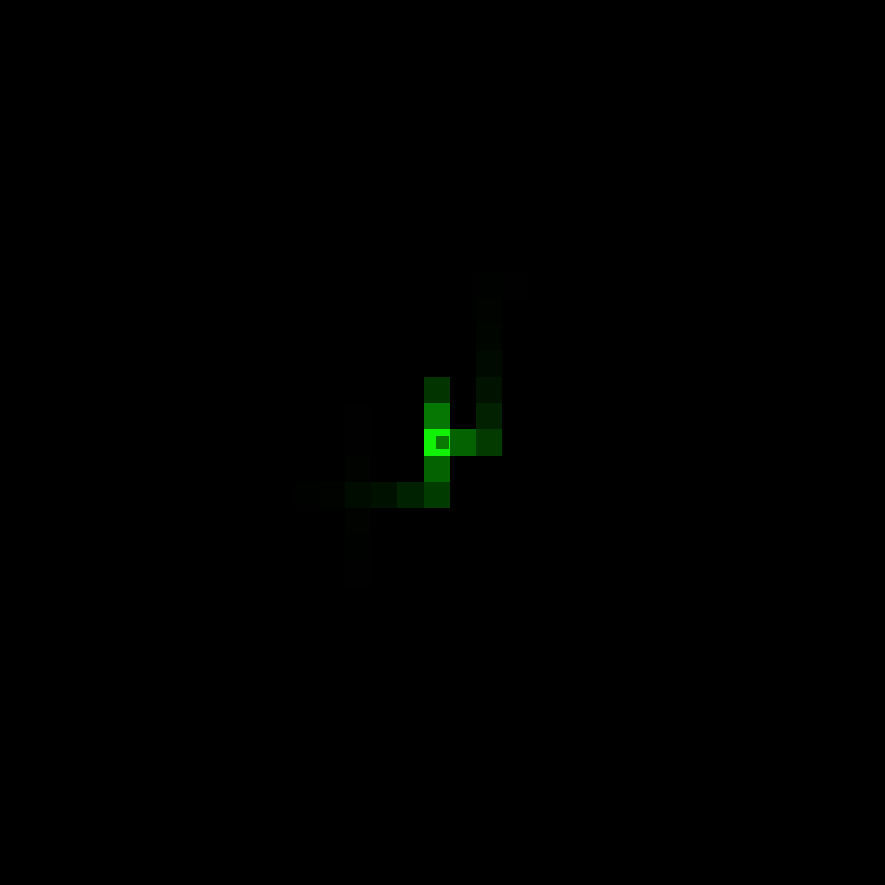
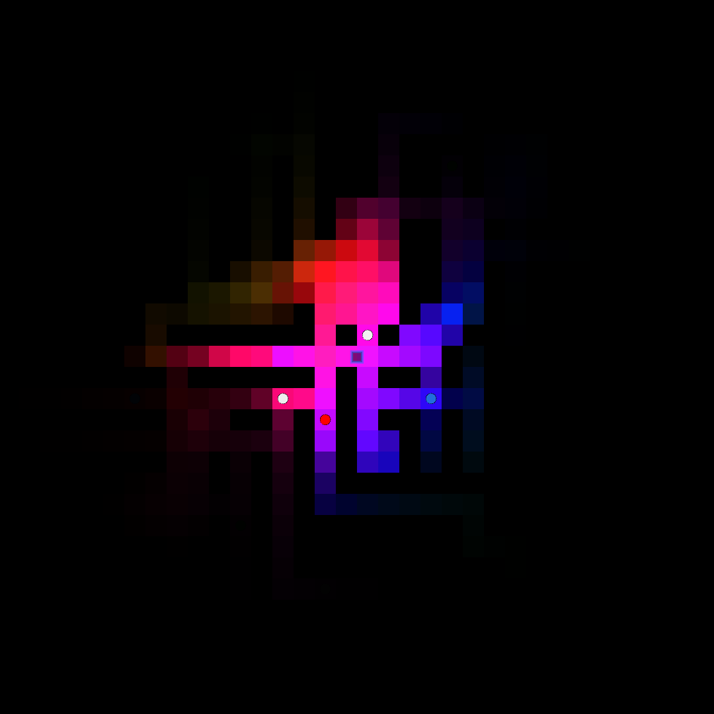
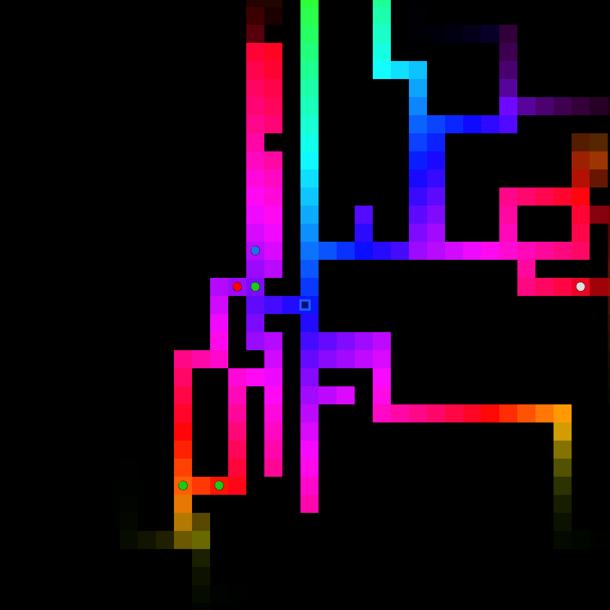
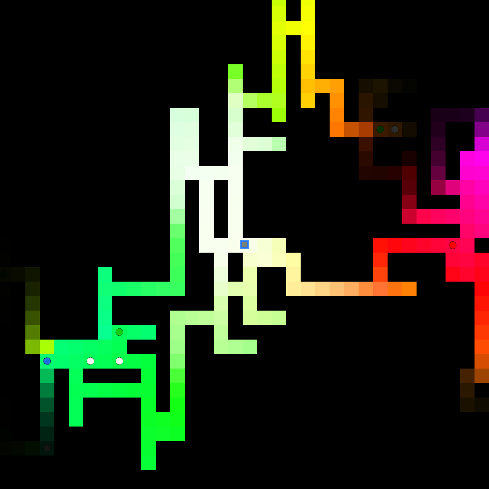

# Beacon

Starting out: a small light in the dark

Click to push out light into the maze.

Too much light bleaches the tiles.

Pick up items to grow your light.

More light reveals more of the maze around you.

Bleach tiles to mark your path. Find a way to the exit tile! 

