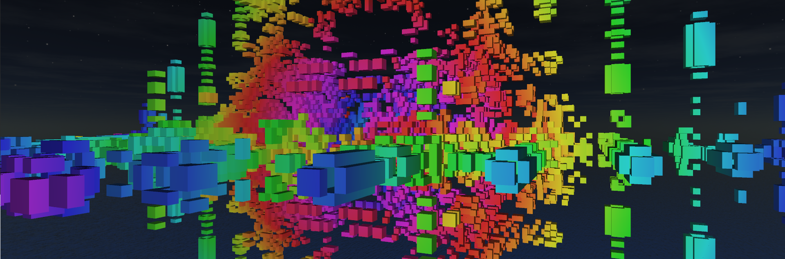
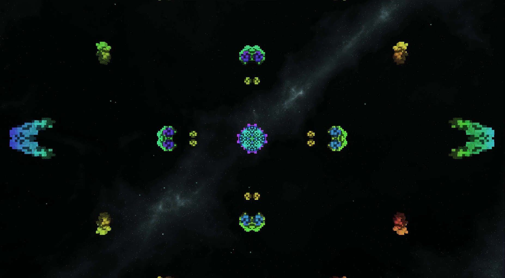

# gol3d

Explore different rules that control how cubes are born, change, and die in an infinite 3D universe. Discover the complex patterns that can arise from simple specifications.

	<video id="myVideo" controls="false" autoplay muted loop poster="./media/gol3d/vidthumb.png">
		<source src="./media/gol3d/cubegrid.mp4" type="video/mp4">
	</video>

Styled after the famous 2D [Conway's Game of Life](https://en.wikipedia.org/wiki/Conway%27s_Game_of_Life) (GoL), **gol3d** is an engine for building and visualizing the evolution 3D cellular automata.

My experiments indicate that the B/S rulespace of GoL produces less interesting results in 3D, so I greatly expanded the space of possible rules and the number of valid states. My quest continues for a rule with the same chaotic, long-lived, but basically stable behavior of the original Game of Life.

## Videos

<iframe src="https://www.youtube.com/embed/SoJvS6GuM3c" frameborder="0" allow="accelerometer; autoplay; clipboard-write; encrypted-media; gyroscope; picture-in-picture" allowfullscreen style="position:absolute;top:0;left:0;width:100%;height:100%;"></iframe>

<iframe src="https://www.youtube.com/embed/EW9Q0qMc2Xc" frameborder="0" allow="accelerometer; autoplay; clipboard-write; encrypted-media; gyroscope; picture-in-picture" allowfullscreen style="position:absolute;top:0;left:0;width:100%;height:100%;"></iframe>

<iframe src="https://www.youtube.com/embed/jXvAfxO2LUY" frameborder="0" allow="accelerometer; autoplay; clipboard-write; encrypted-media; gyroscope; picture-in-picture" allowfullscreen style="position:absolute;top:0;left:0;width:100%;height:100%;"></iframe>

<iframe src="https://www.youtube.com/embed/6Xb_g4WppdY" frameborder="0" allow="accelerometer; autoplay; clipboard-write; encrypted-media; gyroscope; picture-in-picture" allowfullscreen style="position:absolute;top:0;left:0;width:100%;height:100%;"></iframe>

<iframe src="https://www.youtube.com/embed/nzYhxOUmeiU" frameborder="0" allow="accelerometer; autoplay; clipboard-write; encrypted-media; gyroscope; picture-in-picture" allowfullscreen style="position:absolute;top:0;left:0;width:100%;height:100%;"></iframe>

## Code

[Github](https://github.com/heyitsguay/gol3d)

Tested only on 64-bit Linux.
