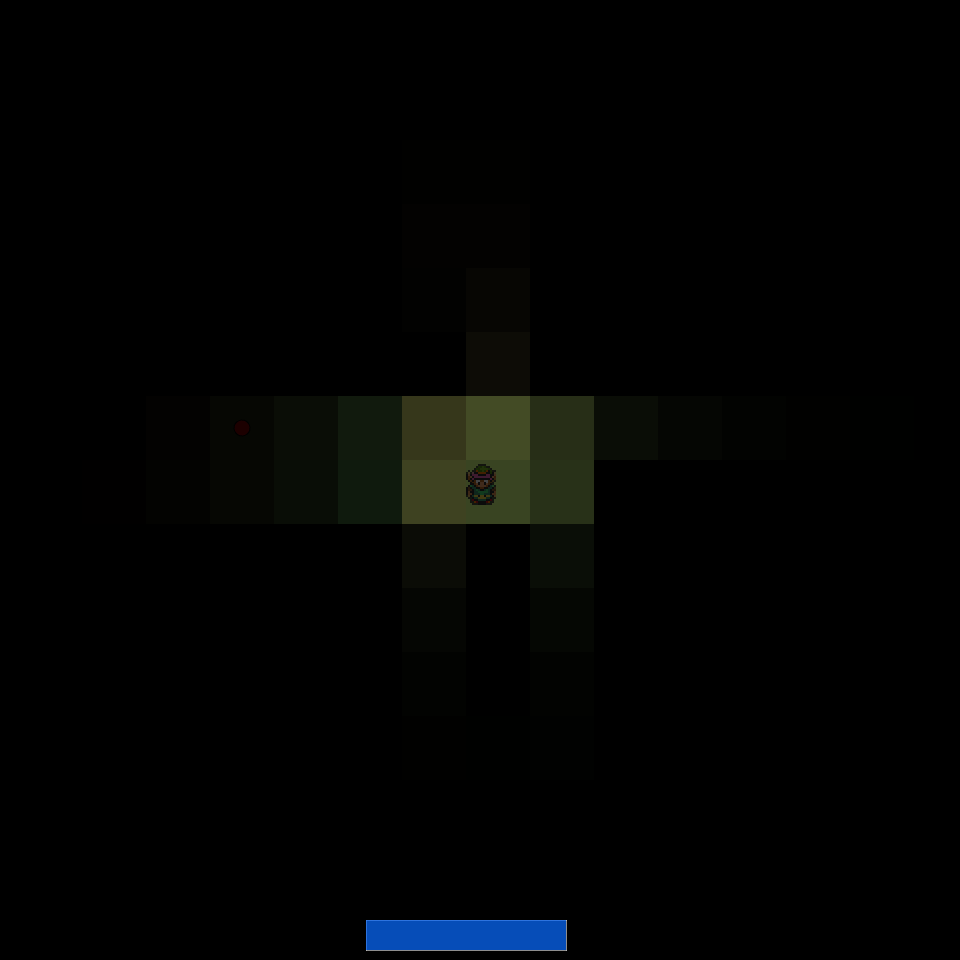
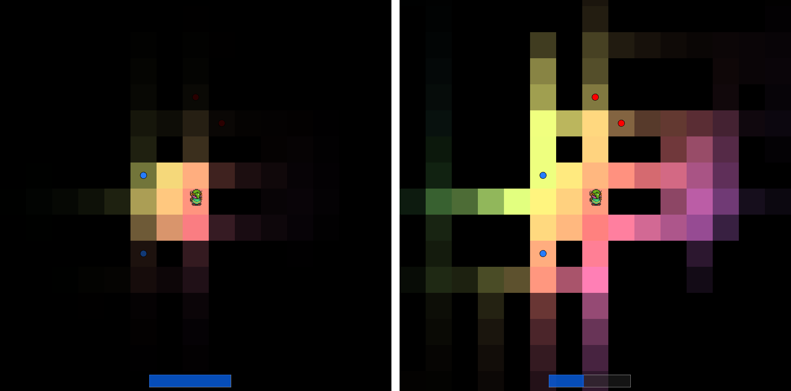
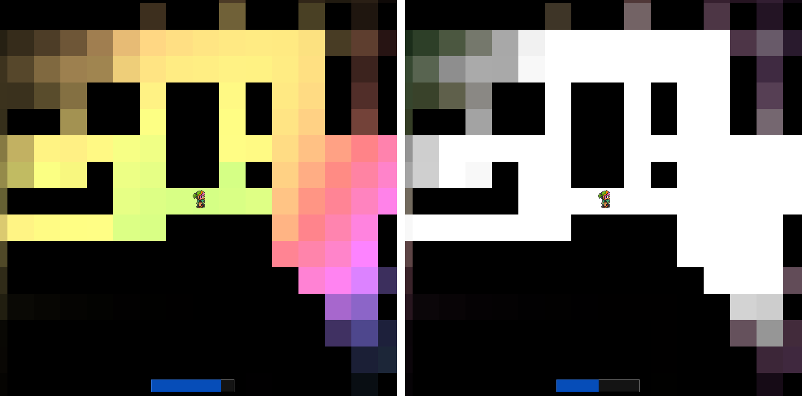
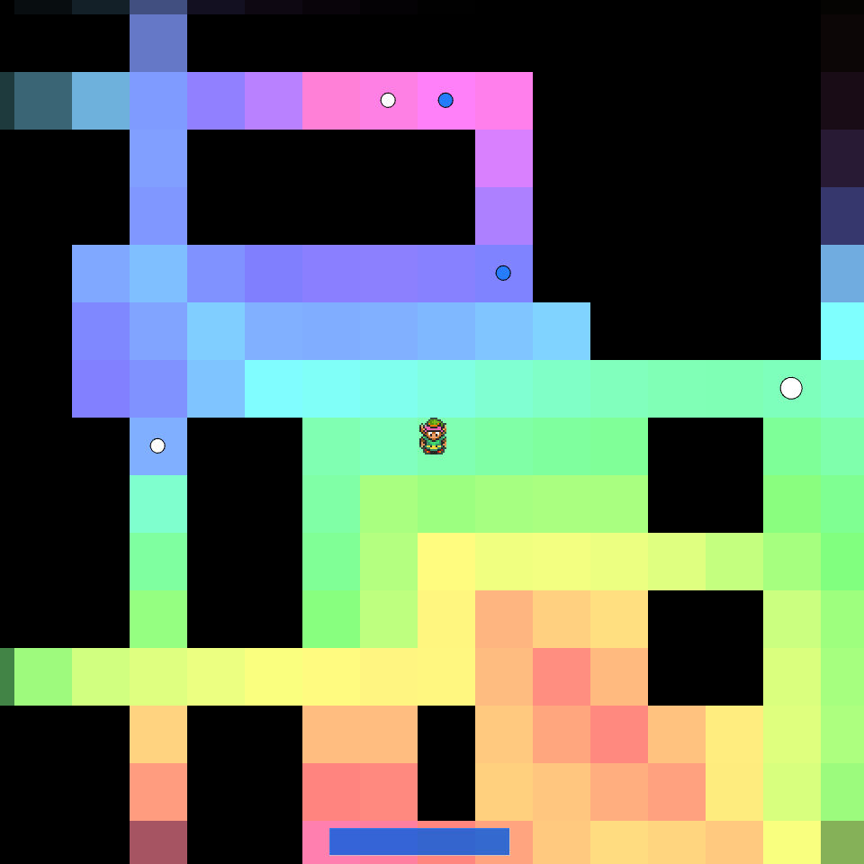
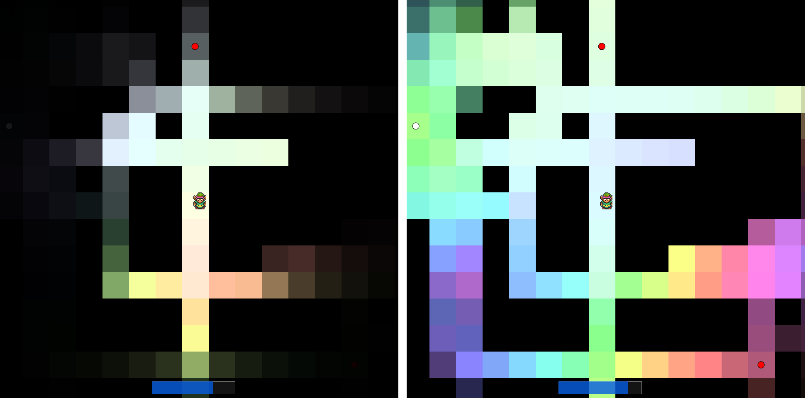

# Lightmaze

Starting out: a small light in the dark, in the top left of the maze.

Click to push out light into the maze.

Too much light bleaches the tiles.

Pick up items to grow your light. More light reveals more of the maze around you.

Bleach tiles to mark your path. Find a way to the exit tile in the bottom right of the maze! 

## Video demo

<iframe src="https://www.youtube.com/embed/YZuFiGgbSR4" frameborder="0" allow="accelerometer; autoplay; encrypted-media; gyroscope; picture-in-picture" allowfullscreen style="position:absolute;top:0;left:0;width:100%;height:100%;"></iframe>

## Download

Using Processing 3's export function, it is possible to create standalone executables for Linux and Windows. Download the appropriate ZIP file below, extract it, and run the executable inside. If you don't know whether you need a 64-bit or 32-bit version, you probably need 64-bit.

[Windows (64bit)](./assets/lightmaze/application.windows64.zip) (90.6 MB)

[Linux (64bit)](./assets/lightmaze/application.linux64.zip) (91.4 MB)

[Windows (32bit)](./assets/lightmaze/application.windows32.zip) (5.2 MB)

[Linux (32bit)](./assets/lightmaze/application.linux32.zip) (5.2 MB)

## Old version

A demo page for an older version of the maze sketch is available at [https://heyitsguay.github.io/projects/pages/lightmaze_old](https://heyitsguay.github.io/projects/pages/lightmaze_old)
